## Implementation approach:
For this movie recommendation application, we can use the Django framework to build the backend and React.js for the frontend. Django provides a robust and scalable web framework, while React.js allows for the creation of interactive and responsive user interfaces. We can also use the TMDb API to obtain movie information and ratings.

## Python package name:
```python
"movie_recommendation"
```

## File list:
```python
[
    "main.py",
    "models.py",
    "views.py",
    "serializers.py",
    "urls.py",
    "templates/index.html",
    "static/css/style.css",
    "static/js/app.js"
]
```

## Data structures and interface definitions:

```mermaid
classDiagram
    class User{
        -int id
        -str username
        -str password
        -str email
        +Profile profile
        +List<Movie> favorite_movies
        +List<Rating> ratings
        +List<Recommendation> recommendations
        +search_movies(query: str) -> List<Movie>
        +rate_movie(movie: Movie, rating: int) -> Rating
    }
    class Profile{
        -int id
        -str name
        -str bio
        -str profile_image
        +User user
    }
    class Movie{
        -int id
        -str title
        -str genre
        -str plot_summary
        -float rating
        -List<Actor> actors
        +List<Rating> ratings
        +List<Recommendation> recommendations
    }
    class Actor{
        -int id
        -str name
        +List<Movie> movies
    }
    class Rating{
        -int id
        -int rating
        -User user
        -Movie movie
    }
    class Recommendation{
        -int id
        -User user
        -Movie movie
    }
    User "1" -- "1" Profile: has
    User "1" -- "*" Movie: favorite_movies
    User "1" -- "*" Rating: ratings
    User "1" -- "*" Recommendation: recommendations
    Movie "1" -- "*" Actor: actors
    Movie "1" -- "*" Rating: ratings
    Movie "1" -- "*" Recommendation: recommendations
    Rating "1" -- "1" User: user
    Rating "1" -- "1" Movie: movie
    Recommendation "1" -- "1" User: user
    Recommendation "1" -- "1" Movie: movie
```


## Program call flow:


## Anything UNCLEAR:
The requirement is clear to me.